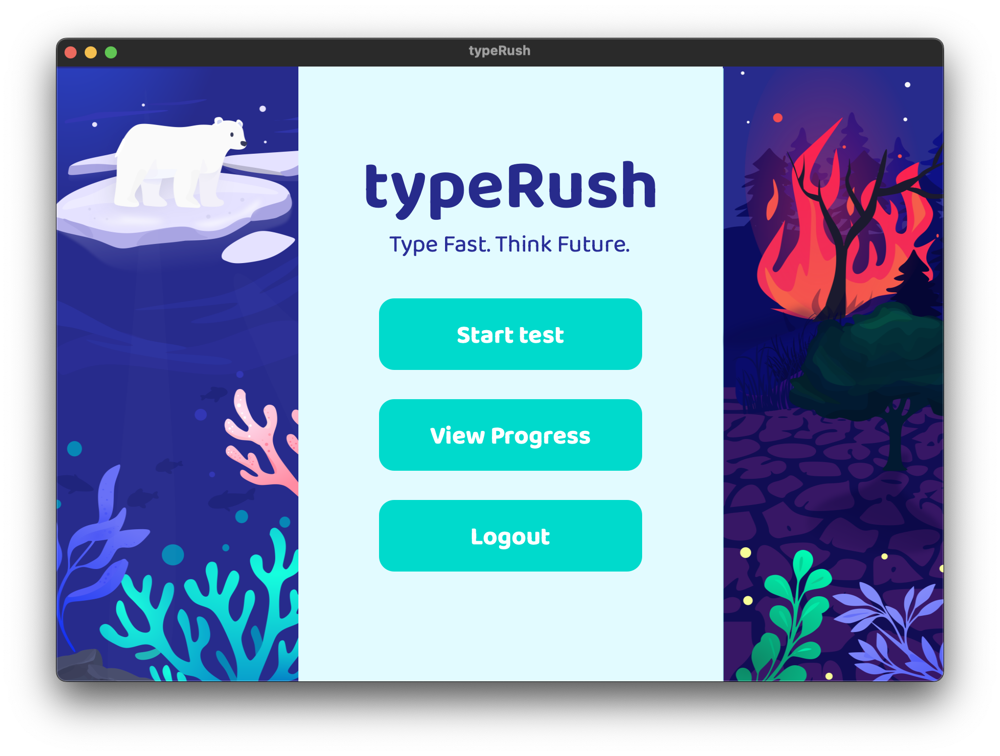
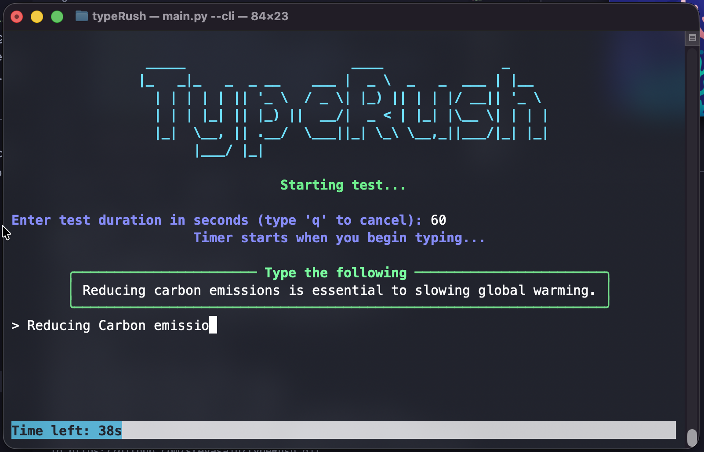

# typeRush






> Under development!

**TypeRush** is an interactive typing game built with Python and PySide6 that can be used as either a graphical user interface (GUI) or command-line interface (CLI) application. It helps not only to track typing *accuracy, words per minute (WPM)*, and other metrics, but also to raise awareness about **climate change**. It also provides feedback to users to help  improve their typing skills by integrating with *MySQL* for storing and fetching data.

## Aim 
The goal of TypeRush is to educate users about climate change and provide a fun and interactive typing test. Each session is loaded with climate facts, to encourage environmentally friendly actions.🌱🌍

## Features 
- Typing Accuracy Tracking- Calculates typing accuracy using the Levenshtein distance.
- WPM Calculation- Measures words per minute.
- Custom GUI- Vibrant PySide6 interface.
- Performance- Shows results after each typing session.
- User Accounts- Register and log in with MySQL to track your progress.

## Prerequisites
- Python 3.10+ installed
- MySQL Server installed and running

## Installation:

Clone the repository:

```bash
git clone https://github.com/sreyasaju/typerush.git
cd typerush
```

Setup a Virtual Environment:
```bash
python3 -m venv venv
source venv/bin/activate  # On Windows use `venv\Scripts\activate`
```

## Environment Setup

TypeRush requires a `.env` file in the project root to store database connection details. Create a file named `.env` and add the following variables:

```
DB_USER=your_database_username
DB_PASS=your_database_password
DB_NAME=typerush_db
DB_HOST=localhost
DB_PORT=3306
```

Replace the values with your MySQL server credentials. This file is required for both GUI and CLI versions to connect to the database.

Install dependencies:
```bash
pip install -r requirements.txt
```

> **Note:** TypeRush supports both GUI and CLI versions. You can run the CLI version by adding the `--cli` flag when starting the script.

Run the script: 
```bash
# Run GUI version
python3 main.py

# Run CLI version
python3 main.py --cli
```

## Contributing
Contributions are welcome! Please submit a pull request or open an issue to discuss potential improvements.
And do star the repo ⭐️

## Credits
- Graphics and UI Elements: All designs and illustrations are self-designed and hence, they are covered under the MIT License
- Font: The app uses [Baloo Chettan 2](https://fonts.google.com/specimen/Baloo+Chettan+2)

## License
```
MIT License

Copyright (c) 2025 typeRush contributors

Permission is hereby granted, free of charge, to any person obtaining a copy
of this software and associated documentation files (the "Software"), to deal
in the Software without restriction, including without limitation the rights
to use, copy, modify, merge, publish, distribute, sublicense, and/or sell
copies of the Software, and to permit persons to whom the Software is
furnished to do so, subject to the following conditions:

The above copyright notice and this permission notice shall be included in all
copies or substantial portions of the Software.

THE SOFTWARE IS PROVIDED "AS IS", WITHOUT WARRANTY OF ANY KIND, EXPRESS OR
IMPLIED, INCLUDING BUT NOT LIMITED TO THE WARRANTIES OF MERCHANTABILITY,
FITNESS FOR A PARTICULAR PURPOSE AND NONINFRINGEMENT. IN NO EVENT SHALL THE
AUTHORS OR COPYRIGHT HOLDERS BE LIABLE FOR ANY CLAIM, DAMAGES OR OTHER
LIABILITY, WHETHER IN AN ACTION OF CONTRACT, TORT OR OTHERWISE, ARISING FROM,
OUT OF OR IN CONNECTION WITH THE SOFTWARE OR THE USE OR OTHER DEALINGS IN THE
SOFTWARE.
```

<hr>
Copyright © 2025-2026 typeRush contributors
